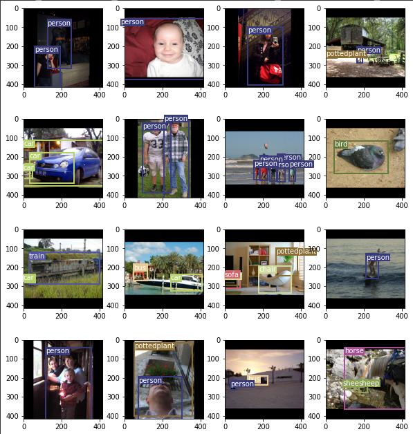

# YOLOv3 PyTorch implementation

This notebook shows implementation of YOLOv3 in PyTorch. The model is implemented from scratch and trained on the Pascal VOC dataset.

While the training results are far from the optimal ones (due to limited resources and training complexity), the notebook shows a clear way how to implement the model, preprocess the data for it and show the results.

## Implementation

As stated before, the model is implemented in PyTorch and the model mirrors the one in the original paper "YOLOv3: An Incremental Improvement".

The model is paired with Adam optimizer with 1e-5 learning rate and 1e-4 weight decay. It is trained on 150 epochs with batch size of 16 (due to hardware limitations).

## Dateset

The model is trained on Pascal VOC dataset, which contains more than 17k images with labels and bounding boxes.

You can check out the original dataset [here](https://www.kaggle.com/huanghanchina/pascal-voc-2012).

## Results

While better results could be achieved, training is slow on the hardware I have access to. If I am able to get access to the better hardware in the future and have enough time, I will try to retrain the model and get better results.

This is the current output of the model.



We can see that it still has trouble with the exact locations of the bounding boxes, especially when there are multiple objects, but for now this is good enough.

You can get pretrained model [here](https://drive.google.com/file/d/14xN9ZQR3PAuQlvFzpQK8TyaLA_47nM3k/view?usp=sharing)

# Reference


```
@misc{redmon2018yolov3,
      title={YOLOv3: An Incremental Improvement}, 
      author={Joseph Redmon and Ali Farhadi},
      year={2018},
      eprint={1804.02767},
      archivePrefix={arXiv},
      primaryClass={cs.CV}
}
```